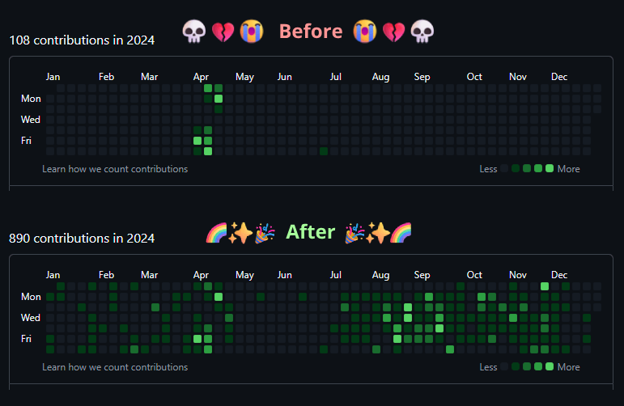

# shadow-git-activity

A Node.js tool to shadow Git commit activity from a source repository into a
target repository.

Useful for showing Git contribution activity without:

- Copying code
- Leaking proprietary information
- Breaking NDAs

It's mirrored activity with integrity.



## What Problem Is This Solving?

I found it disappointing that when I contributed to a company repo on
another hosting platform, or using a dedicated company GitHub account, those
contributions didn't show up on the "All Mighty GitHub Contribution Graph".

I get it, GitHub activity shouldn't be treated as measure of a developer's
actual output. But unconscious biases exist, and that graph does influence how
people perceive your value as a developer.

This project itself is proof enough that you cannot rely on the GitHub
Contribution Graph to accurately gauge development activity.

## What It Does

- Scans commits from a local source repository and branch.
- Filters commits by a list of authors.
- Creates matching shadow commits in a local target repository
- Records the original **SHA**, **Timestamp**, **Author Email**, via commit message
- Modifies a single file, `shadow-activity.log`, to mimic commit activity.

## Installation & Setup

Init a new repository to contain your `shadow-activity.log`:

```bash
git init shadow-git-activity-artifact
# Or whatever you want to call it
```

Clone this project:

```bash
git clone https://github.com/blzaugg/shadow-git-activity.git
cd shadow-git-activity
```

Then copy and configure your config.json:

```bash
cp config-sample.json config.json
# edit config.json to match your repository paths and author settings
```

## Usage

```bash
# Simulate and preview the shadow commits (no commits made)
node shadow.js --dry-run

# Create shadow commits in the target repository
node shadow.js

# Print debug information
node shadow.js --debug
```

---

## Requirements

- Node.js v18+
- Git CLI installed and on `$PATH`

No external npm packages. Uses raw `git` via Node’s `child_process`.

---

## File Structure

```
shadow.js           # Main script
config.json         # Required configuration file
config-sample.json  # Sample configuration file
```

## Author

Byran Zaugg  
[github.com/blzaugg](https://github.com/blzaugg)

## License

MIT
